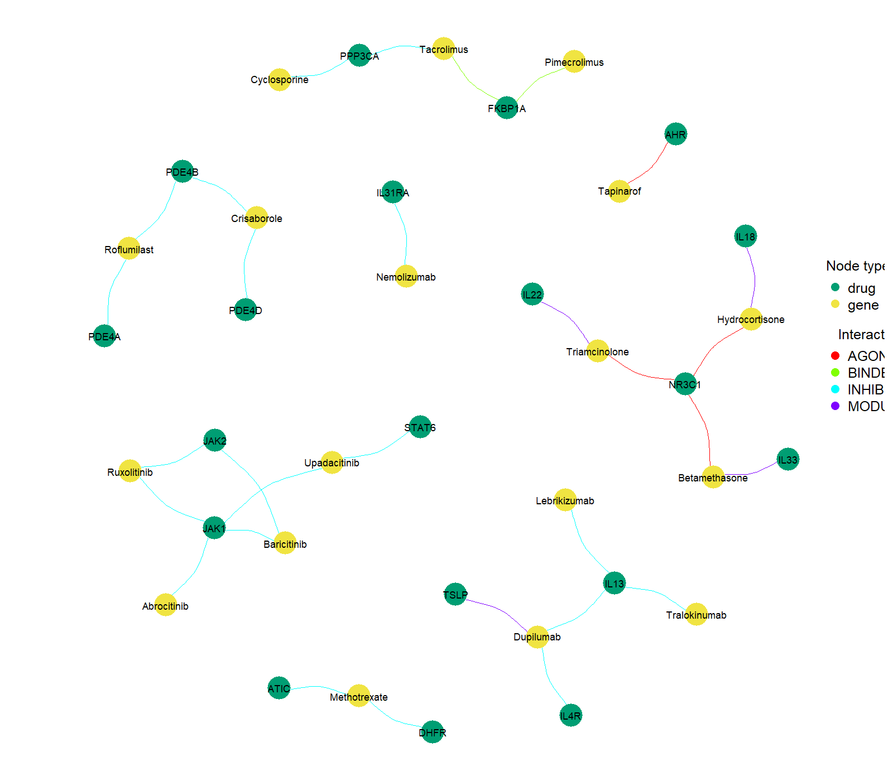
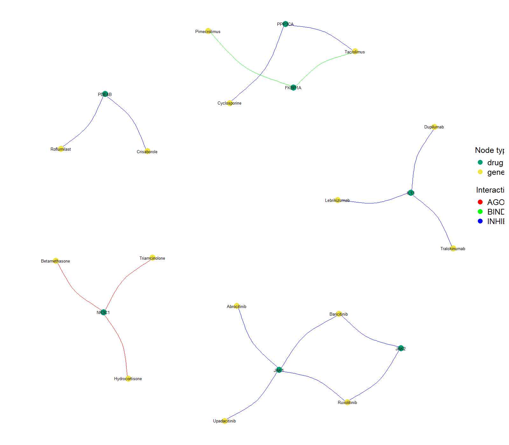
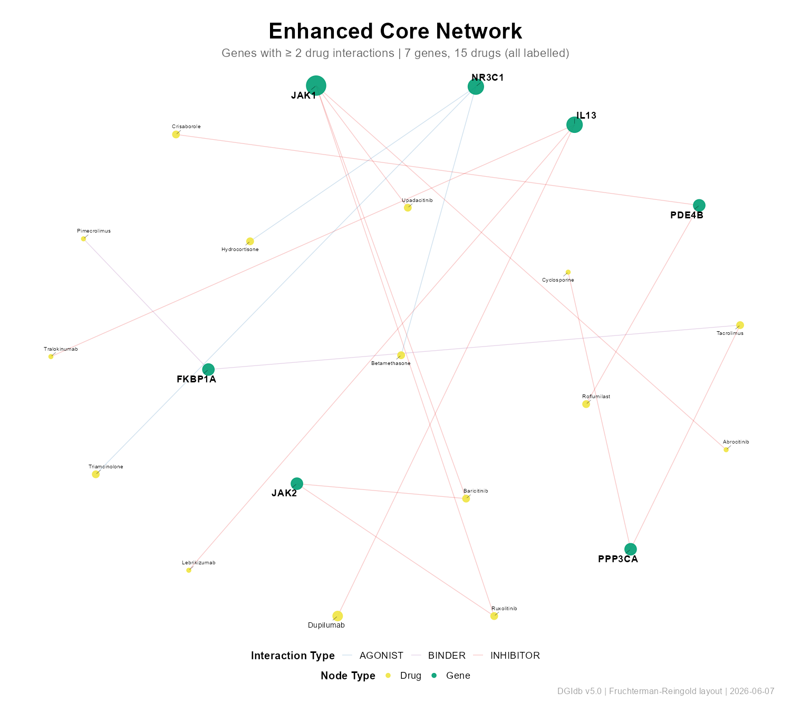
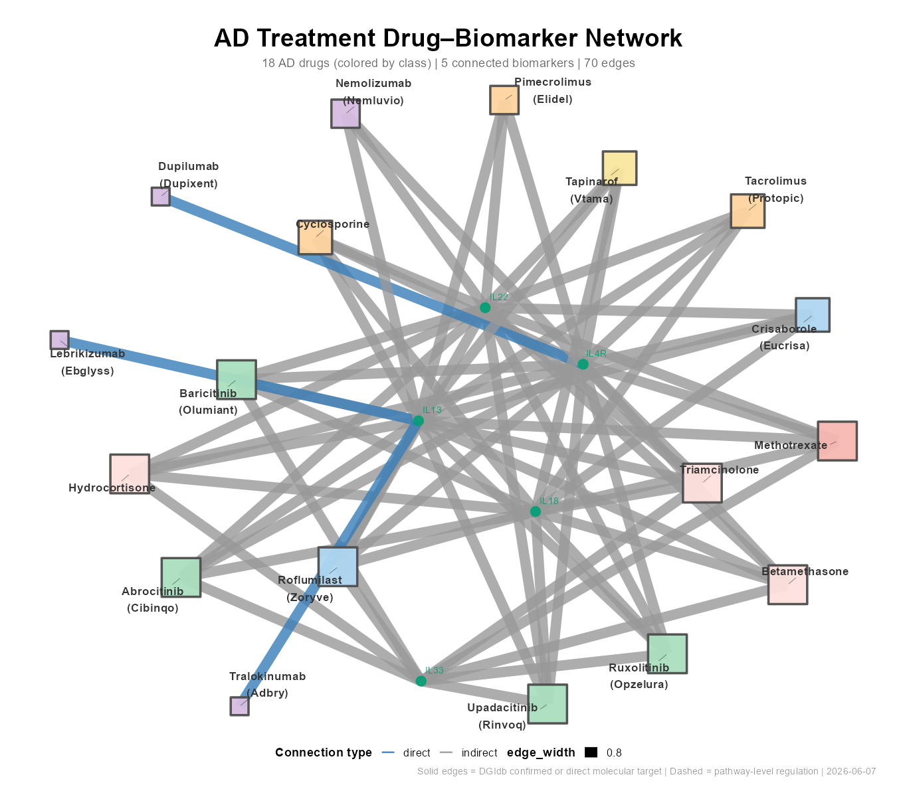
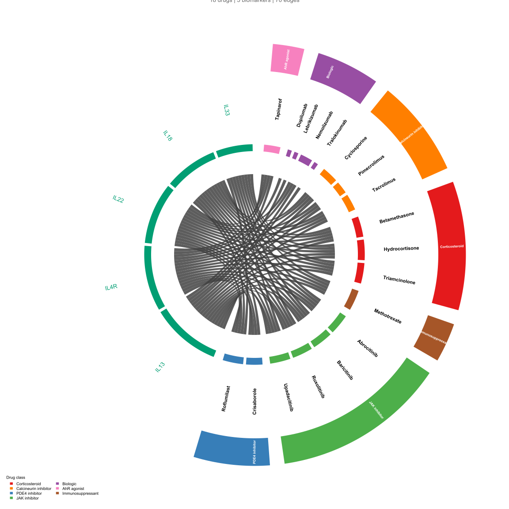
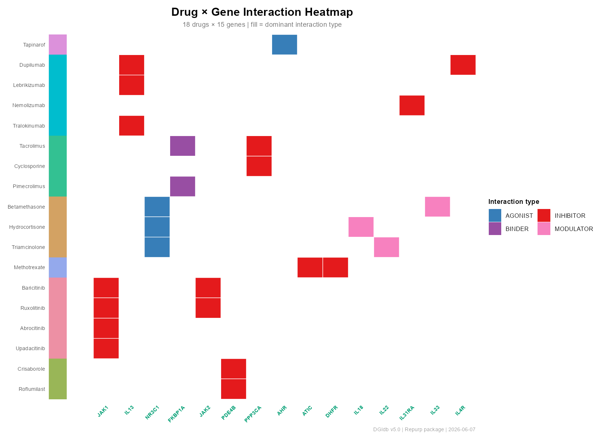
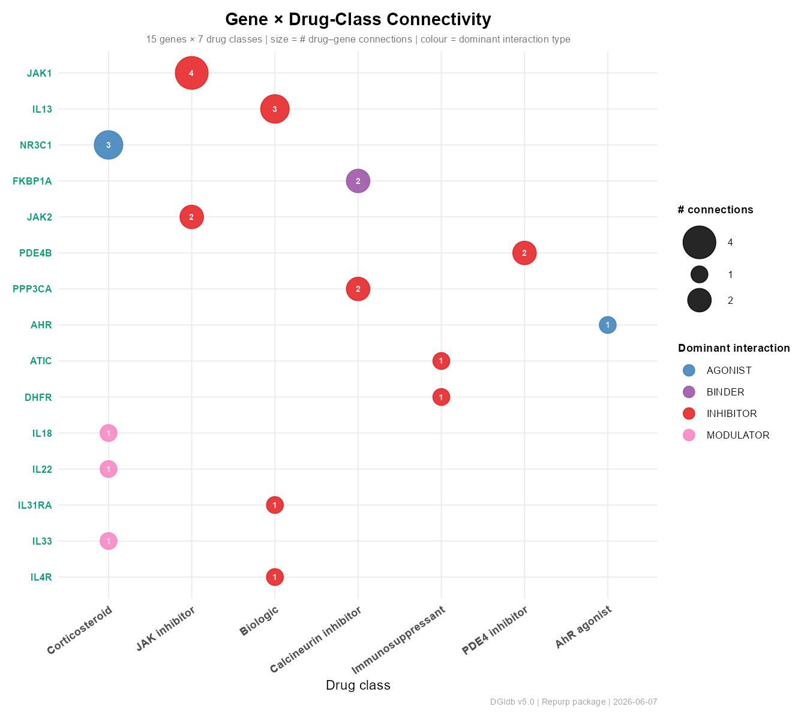
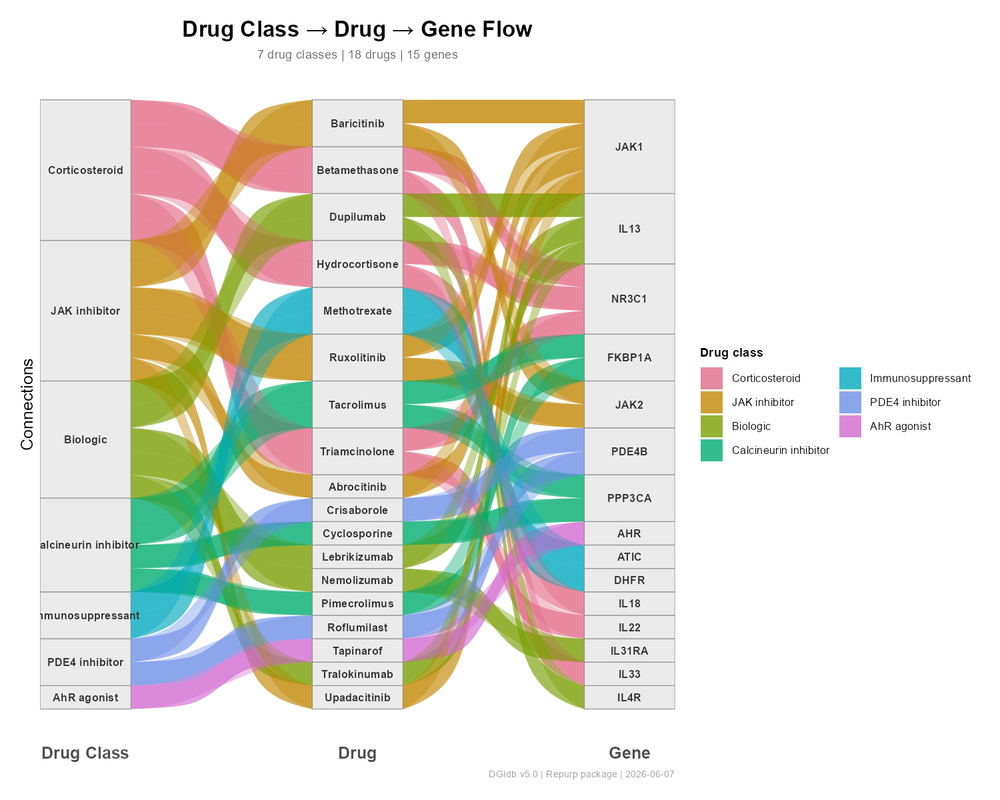

# Repurp — Drug–Gene Interaction Network Visualisation

[](https://www.r-project.org/)
[](LICENSE)

**Repurp** is an R package for building and visualising drug–gene / biomarker interaction networks for drug repurposing studies. It ships **15 visualisation backends**, a curated reference of 18 established atopic-dermatitis (AD) drugs, and a unified colour system shared across all plot types.

---

## Gallery

| | |
|:---:|:---:|
| **igraph — Full Bipartite** | **igraph — Core (genes ≥ 2 drugs)** |
|  |  |
| `plot_dgi_igraph()` | `plot_dgi_igraph_core()` |
| **ggraph Enhanced — Core** | **AD Drug–Biomarker Network** |
|  |  |
| `plot_dgi_ggraph_enhanced(mode="core")` | `plot_dgi_ad_network()` |
| **Chord Diagram — AD Drugs × Biomarkers** | **Heatmap — Drug × Gene** |
|  |  |
| `plot_chord_dgi()` | `plot_dgi_heatmap()` |
| **Dot Matrix — Gene × Drug-Class** | **Sankey — Drug Class → Drug → Gene** |
|  |  |
| `plot_dgi_dotmatrix()` | `plot_dgi_sankey()` |

All plots above were generated from the same synthetic 30-edge AD drug–biomarker dataset using `<30 lines of code`.

---

## Installation

```r
# Install from source
install.packages("path/to/Repurp_0.2.0.tar.gz", repos = NULL, type = "source")

# Suggested packages (install as needed for each backend)
install.packages(c(
  "ggplot2", "ggrepel", "ggnewscale",   # ggraph-family
  "ggraph", "tidygraph",                 # ggraph layouts
  "visNetwork",                          # interactive HTML
  "circlize",                            # chord diagrams
  "ggalluvial"                           # Sankey flow diagram
))
```

---

## Quick Start

```r
library(Repurp)
library(dplyr)

# 1. Load your DGIdb interactions
net_dat <- prepare_dgi_data("interactions.tsv", gene_list = my_gene_list)

# 2. Pick a backend ──────────────────────────────────

# igraph: fast bipartite (SVG + PNG)
plot_dgi_igraph(net_dat, out_dir = "results/")

# igraph core: genes with ≥3 drug connections
plot_dgi_igraph_core(net_dat, min_gene_edges = 3, out_dir = "results/")

# Tripartite: Gene × Drug × Pathway (igraph)
plot_dgi_tripartite_igraph(dgi_edges, pathway_edges, out_dir = "results/")

# ggraph: publication-quality (SVG + PNG)
plot_dgi_ggraph(dgi_edges, out_dir = "results/")

# ggraph enhanced: qgraph FR layout + ggrepel + ggnewscale
plot_dgi_ggraph_enhanced(dgi_edges, mode = "full", out_dir = "results/")
plot_dgi_ggraph_enhanced(dgi_edges, mode = "core", out_dir = "results/")

# AD drug–biomarker network (drug categories + direct/indirect edges)
edges <- repurp_ad_edges() |> filter(to %in% my_genes)
plot_dgi_ad_network(edges, drug_info = repurp_ad_drugs(), out_dir = "results/")

# Circular arc network (poster-ready)
plot_dgi_circular_arc(edges, out_dir = "results/")

# visNetwork: interactive HTML
vn <- build_visnetwork(net_dat, title = "My Network")
save_visnetwork(vn, "results/network.html")

# visNetwork tripartite: Gene + Drug + Pathway
vn_tri <- build_visnetwork_tripartite(net_dat, pathway_edges)

# Chord diagram: drug classes (circlize, SVG)
plot_chord_dgi(edges, out_dir = "results/")

# Combined chord: AD curated + DGIdb hub drugs
plot_chord_dgi_combined(dgi_edges, curated_edges, out_dir = "results/")

# Heatmap: Drug × Gene tile matrix
plot_dgi_heatmap(dgi_edges, drug_info = repurp_ad_drugs(), out_dir = "results/")

# Sankey: Drug Class → Drug → Gene flow
plot_dgi_sankey(dgi_edges, drug_info = repurp_ad_drugs(), out_dir = "results/")

# Dot matrix: Gene × Drug-Class bubble chart
plot_dgi_dotmatrix(dgi_edges, drug_info = repurp_ad_drugs(), out_dir = "results/")
```

---

## Visualisation Backends

| # | Function | Engine | Output | Best for |
|---|----------|--------|--------|----------|
| 1 | `plot_dgi_igraph()` | igraph + qgraph | SVG + PNG | Fast bipartite, large networks |
| 2 | `plot_dgi_igraph_core()` | igraph + qgraph | SVG + PNG | Core genes (≥N drugs) |
| 3 | `plot_dgi_tripartite_igraph()` | igraph + qgraph | SVG + PNG | Gene × Drug × Pathway (base R) |
| 4 | `plot_dgi_ggraph()` | ggraph + tidygraph | SVG + PNG | Tripartite, publication panels |
| 5 | `plot_dgi_ggraph_core()` | ggraph + tidygraph | SVG + PNG | Core tripartite, KK layout |
| 6 | `plot_dgi_ggraph_enhanced()` | ggraph + ggrepel + ggnewscale | SVG + PNG | Hub-labelled FR-layout, journals |
| 7 | `plot_dgi_ad_network()` | ggplot2 + ggrepel + ggnewscale | SVG + PNG | Curated AD drug–biomarker network |
| 8 | `plot_dgi_circular_arc()` | ggraph | SVG + PNG | Circular edge-bundle, posters |
| 9 | `build_visnetwork()` | visNetwork | Interactive HTML | Exploratory, supplementary data |
| 10 | `build_visnetwork_tripartite()` | visNetwork | Interactive HTML | Tripartite interactive |
| 11 | `plot_chord_dgi()` | circlize | SVG | Drug class overview, talks |
| 12 | `plot_chord_dgi_combined()` | circlize | SVG | AD curated + DGIdb hub drugs |
| 13 | `plot_dgi_heatmap()` | ggplot2 | SVG + PNG | Drug × Gene tile matrix |
| 14 | `plot_dgi_sankey()` | ggplot2 + ggalluvial | SVG + PNG | Drug Class → Drug → Gene flow |
| 15 | `plot_dgi_dotmatrix()` | ggplot2 | SVG + PNG | Gene × Drug-Class bubble matrix |

---

## Data Preparation

```r
# Standardise DGIdb interactions
net_dat <- prepare_dgi_data(
  interactions = "interactions.tsv",   # path to DGIdb TSV download
  gene_list    = c("IL13", "IL4R", "JAK1", "JAK2", "PDE4B", "TSLP")
)
# Returns tibble: Gene | Drug | InteractionType | [Source] | [interaction_score]
```

---

## Curated AD Drug Reference

```r
repurp_ad_drugs()   # 18 established AD drugs with class & molecular targets
repurp_ad_edges()   # 106 curated mechanism-of-action edges (direct / indirect)
```

| Drug | Brand | Class | Known Target |
|------|-------|-------|-------------|
| Hydrocortisone | OTC | Corticosteroid | NR3C1 (GR) |
| Tacrolimus | Protopic | Calcineurin inhibitor | FKBP1A; PPP3CA |
| Crisaborole | Eucrisa | PDE4 inhibitor | PDE4B; PDE4D |
| Dupilumab | Dupixent | Biologic | IL4R |
| Upadacitinib | Rinvoq | JAK inhibitor | JAK1 |
| ... | ... | ... | ... |

---

## Colour Palettes

```r
dgi_edge_colors         # 14 interaction types → hex
dgi_node_colors         # Gene / Drug / Pathway → hex
dgi_interaction_styles  # Full style table (sector, link, lty)
repurp_class_colors()   # 13 drug classes → hex
```

---

## Multi-Panel Figures

All ggraph/ggplot2 functions return `ggplot` objects — compose with **patchwork**:

```r
library(patchwork)
p1 <- plot_dgi_ggraph_enhanced(dgi_edges, mode = "core")
p2 <- plot_dgi_dotmatrix(dgi_edges, drug_info = repurp_ad_drugs())
p3 <- plot_dgi_heatmap(dgi_edges, drug_info = repurp_ad_drugs())

(p1 | p2) / p3 +
  plot_annotation(title = "AD Drug–Biomarker Network Summary")
```

---

## Comparing Gene Sets

```r
# Systemic vs non-systemic AD contrasts
p_sys  <- plot_dgi_ggraph_enhanced(edges_sys,  mode = "core", title = "Systemic AD")
p_nsys <- plot_dgi_ggraph_enhanced(edges_nsys, mode = "core", title = "Non-systemic AD")
p_sys + p_nsys
```

---

## Dependencies

| Status | Packages |
|--------|----------|
| **Imports** (always installed) | dplyr, tidyr, tibble, stringr, rlang, igraph, qgraph, RColorBrewer |
| **Suggests** (install as needed) | visNetwork, ggraph, tidygraph, ggplot2, ggrepel, ggnewscale, scales, circlize, rbioapi, ggalluvial |

---

## Vignette

```r
browseVignettes("Repurp")
# or
vignette("repurp-intro", package = "Repurp")
```

---

## License

MIT — see [LICENSE](LICENSE)

---

## Author

**Hung Tran** — [tranhungydhcm@gmail.com](mailto:tranhungydhcm@gmail.com)
